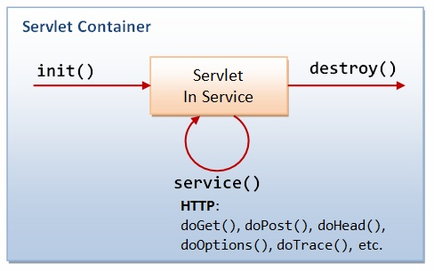

# Servlet

### Servlet
일반적으로 웹 서버는 정적인 페이지만 제공한다. 동적인 페이지를 제공하기 위해서는 다른 곳에 도움을 요청하여 동적인 페이지를 작성해야 하는데, 이 때 동적인 페이지를 제공할 수 있도록 도와주는 어플리케이션이 서블릿이며, 동적인 페이지를 생성하는 어플리케이션이 CGI이다.

* 웹에서 Java 프로그래밍을 구현하기 위해 탄생
* Java로 구현된 CGI(Common Gateway Interface)라고들 흔히 말한다.
* HTTP protocol 서비스를 지원하는 `javax.servlet.http.HttpServlet` 클래스를 상속하여 개발, Servlet은 Container에 의해서 실행되고, 관리된다.
* HTML 변경시 Servlet을 재 컴파일 해야하는 단점이 있다.
* Java Thread를 이용하여 동작한다.

> CGI는 외부의 응용 프로그램(검색 엔진이나 DB 등)과 웹 서버를 연결시켜주는 "표준"을 의미한다. 독립적으로 실행되는 응용 프로그램에 웹에서 입력받은 정보를 입력으로 전달하든지, 응용 프로그램에서 실행된 결과를 웹에 전달해야 하는는 등의 일을 위해서 사용되는 표준방법이다.

### Servlet Container
* HTTP 요청을 받아서 Servlet을 실행시키고, 그 결과를 사용자 브라우저에게 전달해주는 기능을 제공하는 컴포넌트
* Servlet을 실행하고 생명주기를 관리
* Servlet과 웹 서버(Apache, nginx...)가 서버 통신 할 수 있는 방법 제공
* 멀티 스레딩을 지원하여 클라이언트의 다중 요청을 알아서 처리
    * 요청이 올 때마다 새로운 자바 쓰레드를 하나 생성하여 HTTP 메소드를 실행하고 자동으로 죽게된다.
* 대표적인 Container에는 Tomcat, jetty, jboss 등이 있다.

### Servlet 생명 주기
Servlet의 메소드
* init() : 초기화
* service() : 클라이언트의 요청을 처리
* destroy() : 종료
> 서블릿이 생명을 다 한 순간에는 적절하게 GC을 진행한다.

1. 클라이언트의 요청이 들어오면 서블릿이 메모리에 있는지 확인 후 없을 경우 init() 메소드를 호출하여 적재
2. init()이 호출된 후 클라이언트의 요청에 따라서 service() 메소드를 통해 요청에 대한 응답이 doGet(), doPost()로 분기된다. 이 때 서블릿 컨테이너가 클라이언트의 요청이 오면 가장 먼저 처리하는 과정으로 생성된 HttpServletRequest, HttpServletResponse에 의해 request와 response 객체가 제공된다.
3. 컨테이너가 서블릿에 종료 요청을 하면 destroy() 메소드를 호출한다.

Servlet 동작 과정

1. 사용자가 요청을 보내면 HTTP Request를 Servlet Container로 전송한다.
2. HTTP Request를 전송받은 Servlet Container는 HttpServletRequest, HttpServletResponse 두 객체를 생성한다.
3. web.xml은 사용자가 요청한 URL을 분석하여 어느 서블릿에 대한 요청을 한 것인지 찾는다.
4. 해당 서블릿에서 service메소드를 호출한 후 클라이언트의 요청에 따라 doGet(), doPost() 등을 호출한다.
5. doGet(), doPost() 등의 메소드가 실행된 후 HttpServletResponse객체에 응답을 보낸다.
6. 응답이 끝나면 HttpServletRequest, HttpServletResponse 두 객체를 소멸시킨다.

### DD(배포서술자, Deployment Descriptor) = web.xml
* Servlet, Error Page, Listener, Filter, 보안 설정 등 Web Application의 설정 파일
* URL과 실제 서블릿의 매핑 정보를 담고 있다.
* 하나의 웹 어플리케이션에 하나만 존재

출저
* http://wiki.gurubee.net/pages/viewpage.action?pageId=26740202
* https://mangkyu.tistory.com/14