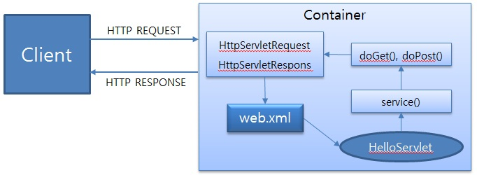

# Servlet

### Servlet
* 웹에서 Java 프로그래밍을 구현하기 위해 탄생
* Java로 구현된 CGI(Common Gateway Interface)라고들 흔히 말한다.
* HTTP protocol 서비스를 지원하는 `javax.servlet.http.HttpServlet` 클래스를 상속하여 개발, Servlet은 Container에 의해서 실행되고, 관리된다.
* HTML 변경시 Servlet을 재 컴파일 해야하는 단점이 있다.

### Servlet Container
* HTTP 요청을 받아서 Servlet을 실행시키고, 그 결과를 사용자 브라우저에게 전달해주는 기능을 제공하는 컴포넌트
* Servlet을 실행하고 생명주기를 관리
* Servlet과 웹 서버(Apache, nginx...)가 서버 통신 할 수 있는 방법 제공
* 멀티 스레딩을 지원하여 클라이언트의 다중 요청을 알아서 처리
* 대표적인 Container에는 Tomcat, jetty, jboss 등이 있다.

Servlet 동작 과정

### DD(배포서술자, Deployment Descriptor) = web.xml
* Servlet, Error Page, Listener, Filter, 보안 설정 등 Web Application의 설정 파일
* URL과 실제 서블릿의 매핑 정보를 담고 있다.
* 하나의 웹 어플리케이션에 하나만 존재

출저
http://wiki.gurubee.net/pages/viewpage.action?pageId=26740202
